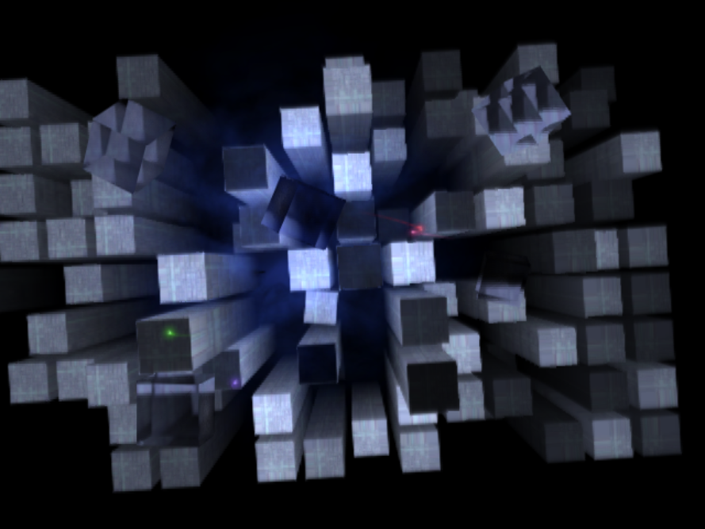

# OSDSYS reverse engineering

Reverse engineering of the PS2 OSDSYS — the boot ROM's on-screen display
(boot animation, browser, system configuration) — from a retail OSDSYS
image.

## Layout

- `osdbits/` — buildable reconstruction of the opening ("towers") boot
  animation as a standalone EE program.  Towers, fog, light streaks and
  the refractive cubes are ported and verified against the real ROM
  (GS-dump and savestate comparisons), running both under PCSX2 and on
  real hardware.
- `docs/` — analysis notes: `towers-analysis.md` is the full trace of the
  tower/cube pipeline (the lab notes behind the code), plus a structure
  report, menu rendering notes, and a cross-reference to the osdsys_re
  symbol database.
- `vucode_*` — the image's VU microcode: disassembly (`.vu`) and
  reconstructed dvp-as source (`.vsm`).
- `tools/` — resource extraction (see below).

## Building osdbits

The repo contains none of Sony's data.  The textures are extracted from
a PS2 BIOS image you dumped from your own console (the same file PCSX2
uses):

    python3 tools/extract-res.py path/to/bios.bin osdbits/res

Building requires the SCE PS2 EE toolchain (`ee-gcc`, `ee-dvp-as`) with
the SDK at `/usr/local/sce/ee`:

    cd osdbits
    make        # produces main.elf
    make run    # runs on a TOOL via dsedb

The ELF also runs under PCSX2.  Optional arguments
`main.elf [mode] [seed [ngames [nboots [framelimit]]]]`:

- `mode` — `boot` (default): the real boot sequence — camera drift,
  fly-up, "Sony Computer Entertainment" text, scene end; `idle`: stay
  over the tower field forever; `illegal`: the illegal-disc scene
  (red clouds, flare, cubes, "please insert a ... disc" text).
- the numeric args control the simulated memory-card boot history the
  tower field is generated from (`ngames 0` lights up the whole field;
  `framelimit` exits after N frames for scripted screenshots).

## Status

- Opening scene: towers, fog, light streaks, refractive cubes, the
  camera state machine (fly-up and scene end) and the "Sony Computer
  Entertainment" text overlay — done and verified.  A few small init
  helpers remain stubs (see `osdbits/opening.c`).
- Illegal-disc screen: ported (red cloud particles, the flare discs and
  lens sprites, the red glass cubes, localized text, screen fades) —
  not yet verified against the real ROM.
- Menu/browser: notes only, see `docs/menu-rendering-reverse.md`.
